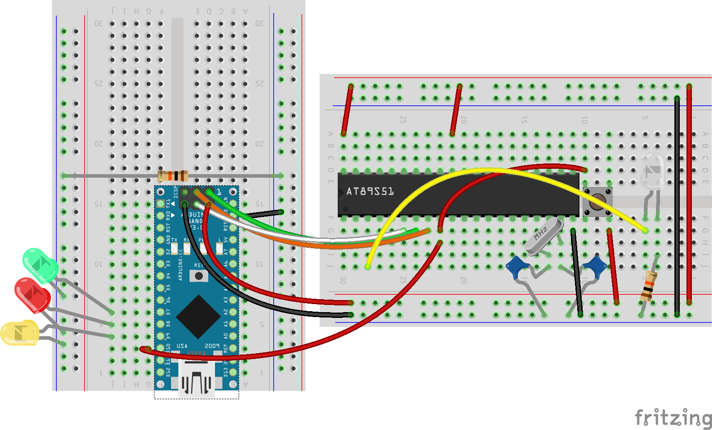
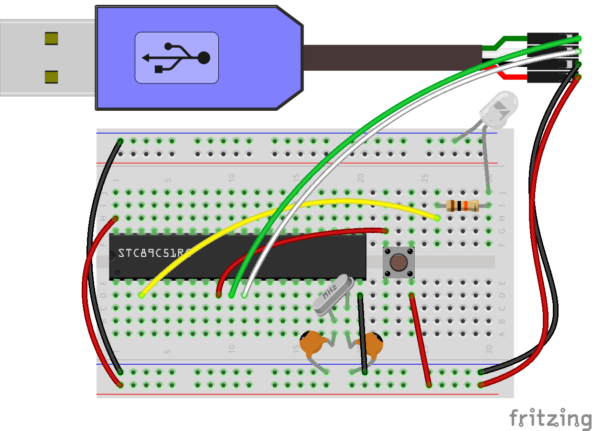

:icons: font

= About

Instructions to download programs to (some) https://en.wikipedia.org/wiki/Intel_MCS-51[Intel MCS-51] compatible MCUs.

== Parts

=== AT89S51

NOTE: Same applies to AT89S52.

=== STC89C51RC

NOTE: Same applies to STC89C52RC and STC12C5A6S2.

== Dependencies

=== Hardware

==== AT89S51, AT89S52

* https://www.arduino.cc/en/Main/Products[Arduino board] (e.g. Nano, Micro, etc.) -- 1 piece
* Microcontroller -- 1 piece
* Breadboard -- 2 pieces
* Jumper wires -- ~20 pieces
* LEDs -- 1 red, 1 green, 1 yellow, 1 white
* 1-10kΩ resistors -- 2 pieces
* 8-33MHz quartz crystal -- 1 piece
* 22pF capacitors -- 2 pieces
* 10-pin ribbon cable -- 1 piece
* 10-pin to 6-pin adapter -- 2 pieces
* Push-button (NO) -- 1 piece

==== STC89C51RC, STC89C52RC, STC12C5A60S2

* https://www.google.com/search?q=USB+to+TTL[USB to Serial/TTL adapter] (e.g. CH340G, PL2303, etc.) -- 1 piece
* Microcontroller -- 1 piece
* Breadboard -- 1 piece
* Jumper wires -- ~10 pieces
* LEDs -- 1 white
* 1-10kΩ resistors -- 1 pieces
* 8-33MHz quartz crystal -- 1 piece
* 22pF capacitors -- 2 pieces
* Push-button (NO) -- 1 piece

=== Software

==== AT89S51, AT89S52

* http://www.moravia-microsystems.com/mcu-8051-ide/[MCU 8051 IDE]
* https://www.arduino.cc[Arduino IDE] -- 1.8.x or above should work
* http://www.nongnu.org/avrdude/[`avrdude`] -- the Arduino IDE distribution contains a recent binary

IMPORTANT: Upload the ArduinoISP sketch onto the Arduino board.

==== STC89C51RC, STC89C52RC, STC12C5A60S2

* http://www.moravia-microsystems.com/mcu-8051-ide/[MCU 8051 IDE]
* https://github.com/grigorig/stcgal[`stcgal`]

== Programming

=== Compile binary

.Windows and Unix
----
mcu8051ide --no-bin --no-sim --assemble blink.asm
----

The output is _blink.hex_.

=== Downloading

==== AT89S51, AT89S52

.Windows
----
avrdude -C %AVRDUDE_HOME%/etc/avrdude.conf -C +./etc/avrdude.conf -c avrisp -p AT89S51 -P COM7 -b 19200 -U flash:w:blink.hex:i
----

==== STC89C51RC, STC89C52RC, STC12C5A60S2

.Windows
----
stcgal -p COM7 blink.hex // <1>
----
<1> Executing this displays _Waiting for MCU, please cycle power_.
Simply disconnect then reconnect VCC.
